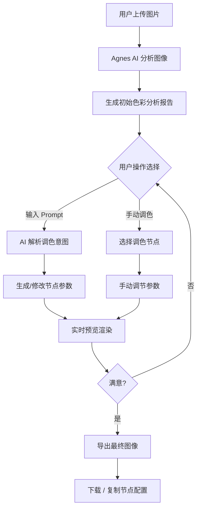
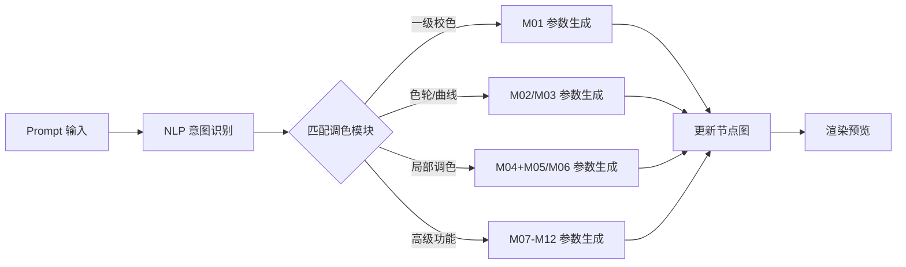

# Agnes AI 调色工作台 - 产品需求文档 (PRD)

## 1. 产品概述

基于 Agnes AI 图像识别引擎的专业级在线调色工作台，通过自然语言 Prompt 驱动 12 大专业调色功能，为影视后期、摄影师及内容创作者提供智能化的色彩分级解决方案。项目以 GitHub Pages 形式部署，无需后端服务即可运行。

**目标用户**: 影视后期制作人员、独立摄影师、短视频创作者、视觉设计师
**核心价值**: 降低专业调色工具门槛，AI 辅助 + 专业级调色能力

## 2. 核心功能

### 2.1 功能模块总览

| 模块编号 | 功能名称 | 英文标识 | 核心描述 |
|---------|---------|---------|---------|
| M01 | 一对一级校色 | PrimaryCorrection | 全局亮度/对比度/饱和度基础调整 |
| M02 | 色轮调色 | ColorWheel | Lift/Gamma/Gain 三路色轮精确控制 |
| M03 | 曲线调色 | Curves | RGB/亮度曲线精细调整 |
| M04 | 二级调色 | SecondaryColor | 选区局部调色（HSL限定） |
| M05 | 限定器抠像 | Qualifier | 基于颜色范围的精准选区 |
| M06 | Power Window 遮罩 | PowerWindow | 几何形状遮罩（圆形/线性/自定义） |
| M07 | 跟踪调色 | Tracking | 运动物体自动跟踪调色 |
| M08 | RGB 混合器 | RGBMixer | 独立通道混合与重映射 |
| M09 | LUT 套用 | LUTApplication | 预设 LUT 文件导入与应用 |
| M10 | 色彩匹配 | ColorMatch | 参考图自动色彩匹配 |
| M11 | 节点工作流 | NodeGraph | 可视化节点式调色流程编排 |
| M12 | 降噪处理 | NoiseReduction | 智能空间/时间域降噪 |

### 2.2 页面结构

#### 2.2.1 主工作台页面 (Home)

| 区域名称 | 子模块 | 功能描述 |
|---------|--------|---------|
| **顶部导航栏** | Logo/标题 | Agnes Color Grading Studio 品牌展示 |
| | 快捷操作 | 导入图片、导出结果、重置、撤销/重做 |
| **左侧面板** | 图片预览区 | 原图/效果图对比显示（分屏/叠加模式） |
| | 缩放控制 | 放大/缩小/适应窗口/1:1 |
| **中央区域** | Prompt 输入区 | 自然语言调色指令输入框（核心交互） |
| | AI 分析面板 | Agnes 识别结果：场景类型、色调分析、建议方案 |
| **右侧面板** | 节点编辑器 | 可视化节点图（支持拖拽连接） |
| | 参数调节面板 | 当前选中节点的详细参数控件 |
| **底部栏** | 历史记录 | 操作历史时间轴，可跳转任意步骤 |
| | 预设库 | 内置调色预设快速应用 |

#### 2.2.2 Prompt 解析功能详情

用户输入示例及对应功能触发：

```
# 示例 Prompt 及解析逻辑

"把画面整体提亮一些，增加暖色调"
→ 触发: M01(一级校色) + M02(色轮- Gain偏暖)

"用曲线压暗高光，提升暗部细节"
→ 触发: M03(曲线调色 - 自定义S曲线)

"只调整天空的颜色，让它更蓝"
→ 触发: M05(限定器-选蓝色) + M04(二级调色)

"给人物面部添加柔光效果，用圆形遮罩"
→ 触发: M06(Power Window-圆形) + M04(二级调色)

"跟踪这个移动的车，把它调成赛博朋克风格"
→ 触发: M07(跟踪) + 多节点组合调色

"套用这个电影感的LUT"
→ 触发: M09(LUT应用)

"让这张照片的色彩匹配参考图的氛围"
→ 触发: M10(色彩匹配)

"创建一个节点流程：先降噪→一级校色→二级调色→输出"
→ 触发: M12 + M01 + M04 (节点工作流)
```

## 3. 核心流程

### 3.1 用户主流程



### 3.2 Prompt 解析流程



## 4. 用户界面设计

### 4.1 设计风格

**设计方向**: 专业暗黑工作室风格 (Professional Dark Studio)

- **主色调**: 深炭灰 `#0d0d0d` 背景 + `#1a1a1a` 面板
- **强调色**: 电光青 `#00d4ff` (选中/激活状态) + 琥珀橙 `#ff9500` (警告/重要操作)
- **辅助色**: 
  - 节点类型色彩编码: 一级校色(绿)`#4ade80` / 二级调色(紫)`#a855f7` / 效果(蓝)`#3b82f6`
- **按钮风格**: 微圆角(6px)、微妙内发光边框、hover 时边框发光增强
- **字体**:
  - 标题: `JetBrains Mono` (技术感/等宽)
  - UI文字: `IBM Plex Sans` (清晰易读)
  - 数值: `Space Mono` (数据展示)
- **布局**: 三栏式专业软件布局 (左预览 / 中Prompt+分析 / 右节点+参数)
- **图标风格**: 线性图标 + 节点使用几何图形区分类型
- **特色元素**: 
  - 节点连线使用贝塞尔曲线 + 数据流动画
  - 波形图/矢量示波器实时显示
  - 暗角渐变背景营造沉浸感

### 4.2 页面设计详情

| 页面/区域 | 设计要素 | 具体实现 |
|----------|---------|---------|
| **顶部导航** | 高度48px, 半透明毛玻璃背景 | Logo居左, 工具按钮居右, 底部1px发光分割线 |
| **左侧预览区** | 固定宽度380px | 支持原图/效果对比滑块, 底部直方图, 缩放控件悬浮 |
| **中央区域** | 弹性宽度, 最小500px | Prompt输入框(多行, placeholder引导), AI分析卡片(可折叠), 快捷标签 |
| **右侧面板** | 固定宽度360px | 节点图画布(上半), 属性面板(下半, 选中节点时显示) |
| **底部历史栏** | 高度56px | 时间轴线, 缩略图预览, 步骤跳转 |

### 4.3 响应式策略

- **桌面优先** (≥1440px): 完整三栏布局
- **中等屏幕** (1024-1439px): 左侧预览可折叠为浮动窗口
- **小屏幕** (<1024px): 单栏堆叠, 面板以抽屉形式弹出

## 5. 技术约束

- **部署方式**: GitHub Pages (纯静态前端, 无后端依赖)
- **图像处理**: Canvas API + WebGL (像素级操作)
- **AI 能力**: 前端模拟 Agnes 识别 (规则引擎 + 预设响应), 预留 API 接口
- **性能要求**: 1080p 图像实时预览 ≥15fps
- **浏览器兼容**: Chrome/Firefox/Safari/Edge 最新两个版本
