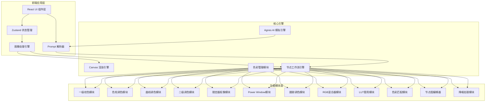
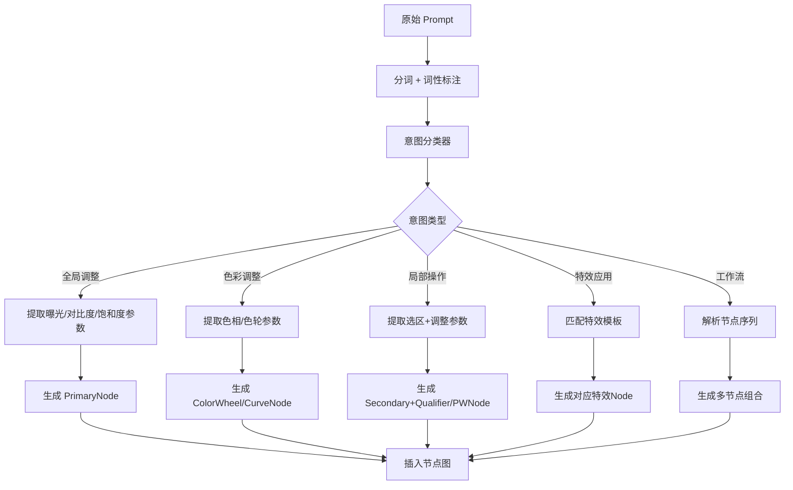

# Agnes AI 调色工作台 - 技术架构文档

## 1. 架构设计



## 2. 技术栈说明

| 类别 | 技术选型 | 版本 | 说明 |
|------|---------|------|------|
| **框架** | React | 18.x | 组件化开发, Hooks 模式 |
| **构建工具** | Vite | 5.x | 快速热更新, 优化构建 |
| **样式方案** | Tailwind CSS | 3.x | 原子化 CSS, 自定义 Design Token |
| **状态管理** | Zustand | 4.x | 轻量级, 支持 middleware |
| **图像处理** | Canvas API + WebGL | - | 像素级操作, GPU 加速 |
| **节点编辑** | ReactFlow | 11.x | 可视化节点图, 拖拽连线 |
| **图表可视化** | Recharts / 自定义Canvas | - | 直方图、波形图、曲线编辑器 |
| **动画** | Framer Motion | 11.x | 界面微交互动画 |
| **图标** | Lucide React | - | 线性图标库 |
| **字体** | Google Fonts | - | JetBrains Mono + IBM Plex Sans |
| **部署** | GitHub Pages | - | 静态站点托管 |

## 3. 项目目录结构

```
agnes-color-studio/
├── public/
│   ├── fonts/                    # 自定义字体文件
│   ├── luts/                     # 预置 LUT 文件 (.cube格式)
│   └── presets/                  # 调色预设 JSON
├── src/
│   ├── main.jsx                  # 应用入口
│   ├── App.jsx                   # 根组件
│   │
│   ├── components/               # UI 组件
│   │   ├── layout/
│   │   │   ├── Header.jsx        # 顶部导航栏
│   │   │   ├── Sidebar.jsx       # 左侧预览面板
│   │   │   ├── MainPanel.jsx     # 中央主面板
│   │   │   ├── RightPanel.jsx    # 右侧节点/参数面板
│   │   │   └── BottomBar.jsx     # 底部历史栏
│   │   ├── preview/
│   │   │   ├── ImagePreview.jsx  # 图片预览组件
│   │   │   ├── CompareSlider.jsx # 对比滑块
│   │   │   ├── Histogram.jsx     # 直方图
│   │   │   └── Waveform.jsx      # 波形图
│   │   ├── prompt/
│   │   │   ├── PromptInput.jsx   # Prompt 输入框
│   │   │   ├── AIPanel.jsx       # AI 分析面板
│   │   │   └── QuickTags.jsx     # 快捷标签
│   │   ├── nodes/
│   │   │   ├── NodeEditor.jsx    # 节点编辑器容器
│   │   │   ├── CustomNodes/      # 自定义节点组件
│   │   │   │   ├── PrimaryNode.jsx
│   │   │   │   ├── ColorWheelNode.jsx
│   │   │   │   ├── CurveNode.jsx
│   │   │   │   ├── SecondaryNode.jsx
│   │   │   │   ├── QualifierNode.jsx
│   │   │   │   ├── PowerWindowNode.jsx
│   │   │   │   ├── TrackingNode.jsx
│   │   │   │   ├── RGBMixerNode.jsx
│   │   │   │   ├── LUTNode.jsx
│   │   │   │   ├── ColorMatchNode.jsx
│   │   │   │   └── NoiseReduceNode.jsx
│   │   │   └── NodeControls.jsx  # 节点连接控制
│   │   └── params/
│   │       ├── ParamSlider.jsx   # 滑块参数
│   │       ├── ColorWheel.jsx    # 色轮控件
│   │       ├── CurveEditor.jsx   # 曲线编辑器
│   │       ├── RGBMixerUI.jsx    # RGB混合器UI
│   │       └── LUTSelector.jsx   # LUT选择器
│   │
│   ├── engines/                  # 核心处理引擎
│   │   ├── canvas/
│   │   │   ├── CanvasEngine.js   # Canvas 渲染主引擎
│   │   │   ├── PixelOps.js       # 像素操作工具集
│   │   │   └── WebGLRenderer.js  # WebGL 加速渲染
│   │   ├── color/
│   │   │   ├── ColorSpace.js     # 色彩空间转换
│   │   │   ├── ColorMath.js      # 色彩数学运算
│   │   │   └── LUTProcessor.js   # LUT 处理器
│   │   ├── grading/
│   │   │   ├── PrimaryGrade.js   # 一级校色算法
│   │   │   ├── ColorWheel.js     # 色轮算法
│   │   │   ├── Curves.js         # 曲线算法
│   │   │   ├── SecondaryGrade.js # 二级调色算法
│   │   │   ├── Qualifier.js      # 限定器算法
│   │   │   ├── PowerWindow.js    # 遮罩算法
│   │   │   ├── Tracker.js        # 跟踪算法(简化版)
│   │   │   ├── RGBMixer.js       # RGB混合算法
│   │   │   ├── ColorMatch.js     # 色彩匹配算法
│   │   │   └── NoiseReduction.js # 降噪算法
│   │   └── workflow/
│   │       ├── NodeGraph.js      # 节点图数据结构
│   │       ├── WorkflowEngine.js # 工作流执行引擎
│   │       └── HistoryManager.js # 历史管理
│   │
│   ├── ai/                       # AI 相关模块
│   │   ├── agnes/
│   │   │   ├── imageAnalyzer.js  # 图像分析器
│   │   │   ├── promptParser.js   # Prompt 解析器
│   │   │   └── suggestEngine.js  # 建议生成引擎
│   │   └── nlp/
│   │       ├── intentRecognizer.js # 意图识别
│   │       └── paramExtractor.js   # 参数提取
│   │
│   ├── store/                    # 状态管理
│   │   ├── useImageStore.js      # 图像状态
│   │   ├── useNodeStore.js       # 节点图状态
│   │   ├── useHistoryStore.js    # 历史状态
│   │   └── useUIStore.js         # UI状态
│   │
│   ├── hooks/                    # 自定义 Hooks
│   │   ├── useImageLoader.js     # 图片加载
│   │   ├── useRenderLoop.js      # 渲染循环
│   │   └── useExport.js          # 导出功能
│   │
│   ├── utils/                    # 工具函数
│   │   ├── math.js               # 数学工具
│   │   ├── colorUtils.js         # 颜色工具
│   │   └── fileUtils.js          # 文件处理
│   │
│   └── styles/                   # 样式文件
│       ├── globals.css           # 全局样式 + Tailwind
│       └── themes.css            # 主题变量
│
├── index.html
├── tailwind.config.js
├── vite.config.js
├── package.json
└── README.md
```

## 4. 路由定义

本项目为单页应用(SPA)，采用状态驱动的视图切换而非传统路由：

| 路径/状态 | 视图 | 说明 |
|----------|------|------|
| `/` (默认) | 主工作台 | 完整三栏工作界面 |
| `/import` | 导入模式 | 大面积拖放区域，引导上传 |
| (modal) | 导出弹窗 | 格式选择、质量设置、下载 |

## 5. 核心数据模型

### 5.1 节点数据模型

```typescript
// 节点基类接口
interface BaseNode {
  id: string;
  type: NodeType;
  position: { x: number; y: number };
  enabled: boolean;
  name: string;
  params: Record<string, any>;
}

// 节点类型枚举
type NodeType = 
  | 'primary'        // M01 一级校色
  | 'colorWheel'     // M02 色轮
  | 'curves'         // M03 曲线
  | 'secondary'      // M04 二级调色
  | 'qualifier'      // M05 限定器
  | 'powerWindow'    // M06 Power Window
  | 'tracking'       // M07 跟踪
  | 'rgbMixer'       // M08 RGB混合器
  | 'lut'            // M09 LUT
  | 'colorMatch'     // M10 色彩匹配
  | 'noiseReduce'    // M12 降噪;

// 各节点参数定义
interface PrimaryParams {
  exposure: number;      // 曝光 (-2 ~ +2)
  contrast: number;      // 对比度 (-1 ~ +1)
  highlights: number;    // 高光 (-1 ~ +1)
  shadows: number;       // 阴影 (-1 ~ +1)
  whites: number;        // 白色 (-1 ~ +1)
  blacks: number;        // 黑色 (-1 ~ +1)
  saturation: number;    // 饱和度 (-1 ~ +1);
}

interface ColorWheelParams {
  lift: { h: number; s: number };   // Lift 色相/饱和度
  gamma: { h: number; s: number };  // Gamma 色相/饱和度
  gain: { h: number; s: number };   // Gain 色相/饱和度
  liftMaster: number;               // Lift 亮度
  gammaMaster: number;              // Gamma 亮度
  gainMaster: number;               // Gain 亮度;
}

interface CurvePoint {
  x: number;
  y: number;
  tangentIn?: { x: number; y: number };
  tangentOut?: { x: number; y: number };
}

interface CurvesParams {
  master: CurvePoint[];
  red: CurvePoint[];
  green: CurvePoint[];
  blue: CurvePoint[];
  hueVsHue: CurvePoint[];
  hueVsSat: CurvePoint[];
  lumVsSat: CurvePoint[];
}

interface QualifierParams {
  hueRange: [number, number];       // 色相范围
  satRange: [number, number];       // 饱和度范围
  lumRange: [number, number];       // 亮度范围
  softness: number;                 // 边缘柔和度
  invert: boolean;                  // 反选;
}

interface PowerWindowParams {
  shape: 'circle' | 'linear' | 'custom';
  centerX: number;
  centerY: number;
  size: number;
  angle: number;
  feather: number;                  // 羽化
  points?: { x: number; y: number }[]; // 自定义形状点;
}

interface RGBMixerParams {
  redOut: { r: number; g: number; b: number };   // Red输出通道
  greenOut: { r: number; g: number; b: number }; // Green输出通道
  blueOut: { r: number; g: number; b: number };  // Blue输出通道;
}

interface LUTParams {
  lutName: string;
  intensity: number;                // 强度 (0 ~ 1)
  cubeData?: number[];              // 自定义 .cube 数据;
}

interface NoiseReduceParams {
  spatialRadius: number;            // 空间半径
  strength: number;                 // 强度
  temporal: boolean;                // 时间降噪(静态图禁用)
  protectDetail: number;            // 细节保护;
}
```

### 5.2 节点连接模型

```typescript
interface Edge {
  id: string;
  source: string;      // 源节点ID
  sourceHandle: string;
  target: string;      // 目标节点ID
  targetHandle: string;
  type: 'default' | 'mask';  // 连接类型(默认/遮罩)
}
```

### 5.3 图像状态模型

```typescript
interface ImageState {
  originalImageData: ImageData | null;   // 原始图像数据
  currentImageData: ImageData | null;    // 当前处理后数据
  width: number;
  height: number;
  fileName: string;
  analysisResult: AnalysisResult | null; // AI 分析结果
}

interface AnalysisResult {
  sceneType: 'portrait' | 'landscape' | 'interior' | 'night' | 'other';
  dominantColors: string[];             // 主要颜色
  brightness: 'dark' | 'normal' | 'bright';
  contrastLevel: 'low' | 'medium' | 'high';
  suggestions: string[];                // 调色建议;
}
```

## 6. 关键算法说明

### 6.1 图像处理管线


每个节点接收上游 ImageData，处理后输出新的 ImageData。

### 6.2 Prompt 解析架构



## 7. 性能优化策略

| 优化项 | 方案 | 目标 |
|-------|------|------|
| **图像处理** | 使用 OffscreenCanvas + Web Worker | 不阻塞主线程 |
| **实时预览** | 降采样预览 + 防抖渲染 | ≥15fps @1080p |
| **节点计算** | 脏标记机制, 仅重算变化链路 | 减少冗余计算 |
| **内存管理** | ImageData 对象池复用 | 降低 GC 压力 |
| **大图支持** | 分块处理 (Tile-based) | 支持 4K+ 图像 |
| **LUT 加载** | 预加载常用 LUT, 异步按需加载 | 即时切换 |

## 8. GitHub Pages 部署配置

- **构建输出**: `dist/` 目录
- **Base Path**: 仓库名称 (如 `/agnes-color-studio/`)
- **SPA 路由**: 使用 hash 模式或 `_redirects` 文件
- **资源引用**: 相对路径, CDN 托管大文件(LUT等)
